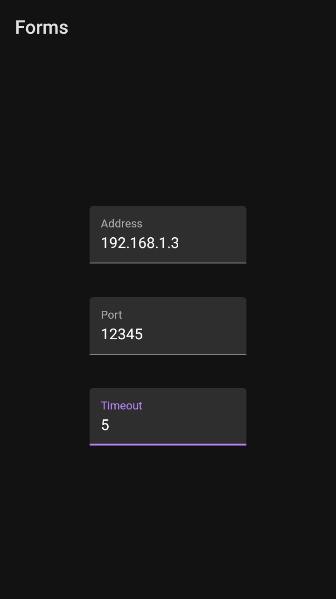
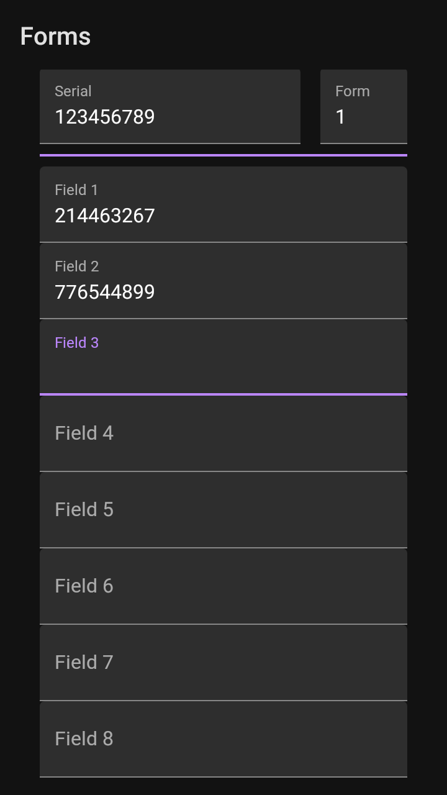
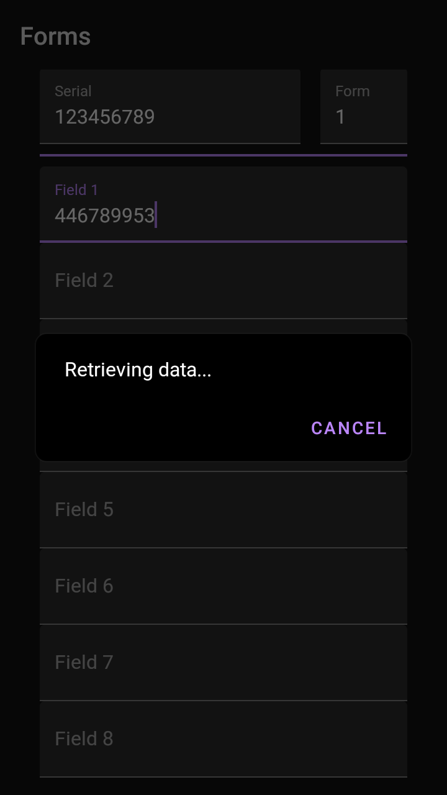
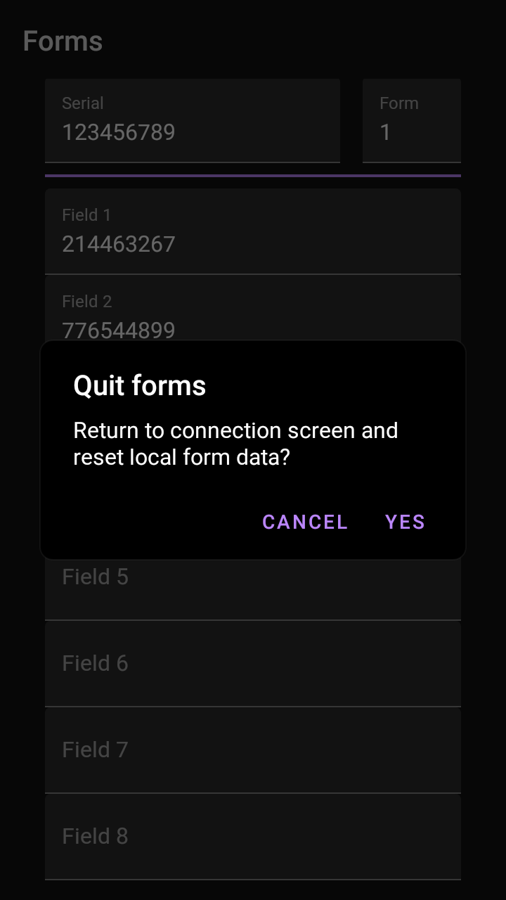

# scancode-forms

This application runs fullscreen.  

## Connection settings screen

This activity starts on application launch.  
There are three text fields. It starts the forms activity when `IME_ACTION_DONE` is triggered and no field is empty.

## Forms screen

This activity starts when `IME_ACTION_DONE` is triggered on the connection settings screen.  
It features 10 input fields and asynchronous network connection via `java.net.Socket` and `AsyncTask`.  
Precautions taken preventing the AsyncTask implementation from creating leaks:
- `RetrieveDataAsyncTask` is a static private member of `FormsActivity`
- access to members of `FormsActivity` is managed via WeakReference member field.

Forms activity displays a non-canceable dialog while connection is pending.  
It's possible to quit the connection early by tapping Cancel.

Forms screen exit confirmation pop-up.  
If accepted, all entered data will be erased, as the activity is destroyed.

